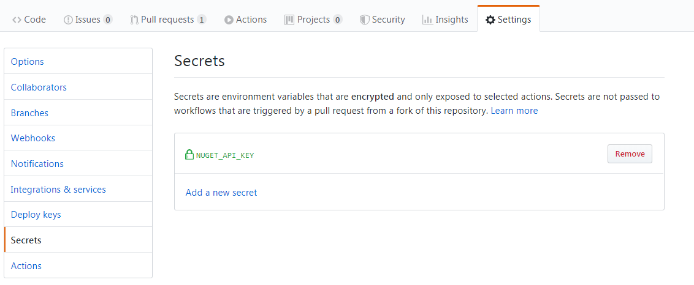

# .NET CI/CD Repository Template

> A template for creating new .NET repositories

This repository is meant to serve as a template for new .NET repositories. The template provides github workflows for automated tests with multiple os/runtimes and automated publishing of NuGet packages.

## Automated tests

The template provides a workflow for automated tests, that are run on multiple os and runtimes.  
The default settings run the tests on windows and linux with the .NET Core 3.0 and 3.1 SDKs.  

## Automated publishing 

The template provides a workflow for automated publishing of NuGet packages.  
All you have to do after following the setup is to update the version number and create a new git tag for that version.

## Default issue templates and .gitignore

The repository includes the github default issue templates for bug reports and feature requests with some minor changes.  
A default .gitignore file for Visual Studio is also included.

# How to use

## Create your .NET Project

The first step after creating a new repository is to create your .NET Solution with a .NET class library project and a .NET test project.

## Add paths to the test workflow

To ensure that the automated tests for your projects are run change the project paths in the `tests.yml` file.  
You can find the file under: `.github/workflows/tests.yml`

Example:
```yml
    ...

    - name: Building project
      run: dotnet build ./YourAwesomeProject/  # path to your .NET class library project 

    - name: Running tests
      run: dotnet test ./YourAwesomeProject.Tests/ # path to your .NET test project
```

## Change test environment matrix (optional)

You can change the default environments by simply editing the strategy matrix in the `tests.yml` file.

Supported Github-hosted runners: https://help.github.com/en/actions/automating-your-workflow-with-github-actions/workflow-syntax-for-github-actions#jobsjob_idruns-on


```yml
    ...

    strategy:

      matrix:
        os: [ windows-latest, ubuntu-latest ]
        dotnet: [ 3.0.100, 3.1.100 ]
    
    ...
```

## Fill Out NuGet Package Metadata

Edit the NuGet.props file and fill in the package metadata for your NuGet package. 

Example:
```xml
  <PropertyGroup>
    <Version>0.1.0</Version>
    <Authors>Armin Herling</Authors>
    <PackageTags>CSharp</PackageTags>
    <PackageDescription>A simple .Net CI/CD repository template</PackageDescription>
    <Copyright>Copyright © Armin Herling</Copyright>
    <PackageLicenseExpression>MIT</PackageLicenseExpression>
    <PackageProjectUrl>https://github.com/arminherling/.NET-CI-CD-Repository-Template</PackageProjectUrl>
    <RepositoryUrl>https://github.com/arminherling/.NET-CI-CD-Repository-Template.git</RepositoryUrl>
    <RepositoryType>git</RepositoryType>
    <PackageIcon>ProjectIcon.png</PackageIcon>
    <PublishRepositoryUrl>true</PublishRepositoryUrl>
  </PropertyGroup>
```

## Import NuGet Package Metadata

The next step is to import the `NuGet.props` file in your class library .csproj file.

Example:
```xml
<Project Sdk="Microsoft.NET.Sdk">

  <PropertyGroup>
    <TargetFramework>netstandard2.0</TargetFramework>
  </PropertyGroup>

  <!-- Add the following line to your .csproj file, make sure the path is relative to the .csproj -->
  <Import Project="../NuGet.props" />

</Project>
```

## Add your Nuget API Key

Now we need an API key to be able to actually publish the NuGet packages.  
All you have to do is create a new key and add it in your repository secrets as `NUGET_API_KEY`.  
Make sure to edit `.github/workflows/nuget.yml` if you use a different name for your github secret.

How to get your API key: https://docs.microsoft.com/en-us/nuget/quickstart/create-and-publish-a-package-using-the-dotnet-cli#acquire-your-api-key

How to add a github secret: https://help.github.com/en/actions/automating-your-workflow-with-github-actions/creating-and-using-encrypted-secrets#creating-encrypted-secrets

The result should look like this:
<p align="center">
  
</p>

## How to publish NuGet packages

The last step to publish your NuGet packages is to increase the version number in the `NuGet.props` file and create a new git tag.  
The tag has to start with 'v' for this to work by default, this can be changed in the `nuget.yml` file.
